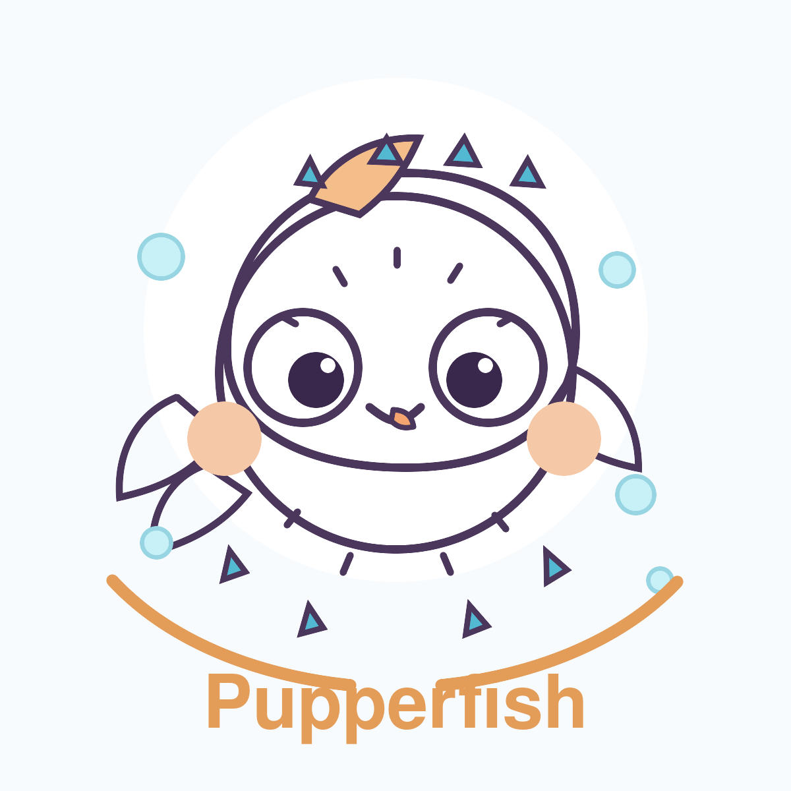

<p align="center">
  
</p>

<h1 align="center">Pupperfish</h1>

<p align="center">
  Headless retrieval runtime and React UI kit for grounded, host-app-owned assistants.
</p>

<p align="center">
  
  
  
  
</p>

## Table of contents
- [What Pupperfish is](#what-pupperfish-is)
- [Packages](#packages)
- [Why this repo exists](#why-this-repo-exists)
- [Prerequisites](#prerequisites)
- [Quickstart](#quickstart)
- [How it fits into a host app](#how-it-fits-into-a-host-app)
- [Documentation map](#documentation-map)
- [Roadmap](#roadmap)
- [Contributing](#contributing)
- [License](#license)
- [Contact](#contact)

## What Pupperfish is
Pupperfish is a public library monorepo that packages a grounded assistant into two reusable pieces:

- `@tungpastry/pupperfish-framework`: a headless runtime that orchestrates retrieval, answer generation, image workflows, and worker hooks.
- `@tungpastry/pupperfish-react`: a React UI kit that renders the chat shell, widget shell, dock, and a generic trade-image gallery.

Pupperfish is **not** a standalone backend app. It does not ship a database, storage backend, auth system, queue implementation, or LLM service. A host application must provide those pieces.

## Packages
| Package | Role | Use when | Entry points |
| --- | --- | --- | --- |
| `@tungpastry/pupperfish-framework` | Headless runtime and contracts | You want retrieval/answer orchestration without adopting a specific backend stack | `createPupperfishRuntime`, `contracts`, `types`, `planner`, `answer` |
| `@tungpastry/pupperfish-react` | React UI kit and client abstractions | You want to embed a full-page assistant, widget launcher, dock, or chart-image gallery into a React app | `PupperfishChatShell`, `PupperfishWidgetShell`, `PupperfishDock`, `TradeImageGalleryManager` |

UI defaults in `@tungpastry/pupperfish-react`:
- composer shortcut mặc định: `Enter` để submit
- `Shift+Enter` để xuống dòng
- consumer có thể đổi sang `composerSubmitMode="meta-enter-to-submit"`

## Why this repo exists
Pupperfish exists to separate reusable assistant behavior from application-specific infrastructure.

The framework owns:
- retrieval-first orchestration
- evidence ranking and answer composition
- chart-image lifecycle hooks
- stable contracts for repositories, AI, storage, jobs, and audit logging

The host app owns:
- the real data repositories
- the real AI provider
- file storage
- queue and worker execution
- audit persistence
- API routes and auth
- domain-specific UI workflows layered on top of the generic shell, such as product-specific chart form autocomplete

That boundary keeps the assistant portable without pretending every product has the same backend.

## Prerequisites
- Node.js 20+
- npm 10+
- a host app or integration harness if you want to exercise the runtime meaningfully

## Quickstart
```bash
npm install
npm run build
npm run test
npm run release:check
```

### What the scripts do
- `npm run build`: builds both publishable workspaces
- `npm run test`: runs smoke tests for the framework and React package
- `npm run release:check`: lint, build, smoke-test, and generate npm packs for both packages

## How it fits into a host app
A host application integrates Pupperfish in two layers:

1. Build a runtime by passing real implementations for:
   - repositories
   - AI provider
   - storage provider
   - job queue
   - audit logger
2. Pass a `PupperfishClient` into the React package so the UI can call your API surface.

```ts
import { createPupperfishRuntime } from "@tungpastry/pupperfish-framework";

const runtime = createPupperfishRuntime({
  repositories,
  aiProvider,
  storageProvider,
  jobQueue,
  auditLogger,
  config: {
    branding: {
      assistantName: "Pupperfish",
      productName: "My Host App",
    },
  },
});
```

```tsx
import { PupperfishChatShell } from "@tungpastry/pupperfish-react";
import "@tungpastry/pupperfish-react/styles.css";

<PupperfishChatShell client={client} branding={{ assistantName: "Pupperfish" }} />;
```

## Documentation map
- [Docs index](docs/README.md)
- [Architecture](docs/architecture.md)
- [API reference](docs/api-reference.md)
- [Deployment and release guide](docs/deployment.md)
- [Troubleshooting](docs/troubleshooting.md)
- [Getting started tutorial](docs/tutorials/getting-started.md)
- [Framework package README](packages/pupperfish-framework/README.md)
- [React package README](packages/pupperfish-react/README.md)

## Roadmap
- expand package-level API examples beyond smoke-test depth
- add richer host-app integration recipes for Next.js and Node services
- publish deeper guidance for repository adapters and worker implementations
- add more focused troubleshooting around React styling and runtime contracts

## Contributing
Open-source contribution guidelines are not formalized yet. For now:
- open an issue for API changes or integration pain points
- keep examples aligned with the current exported surface
- avoid documentation that claims behavior not present in source

## License
Licensed under the [MIT License](LICENSE).

## Contact
- Repository: <https://github.com/tungpastry/pupperfish>
- npm scope: [`@tungpastry`](https://www.npmjs.com/search?q=%40tungpastry)
