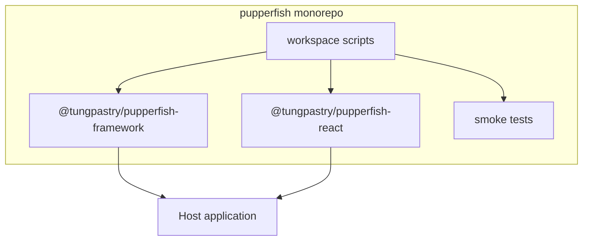
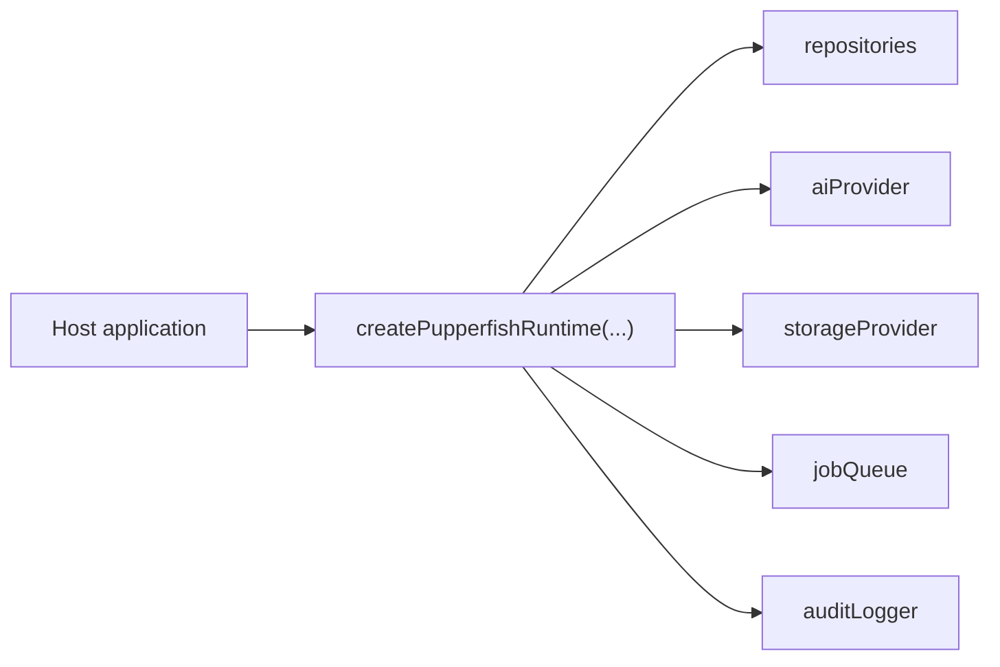
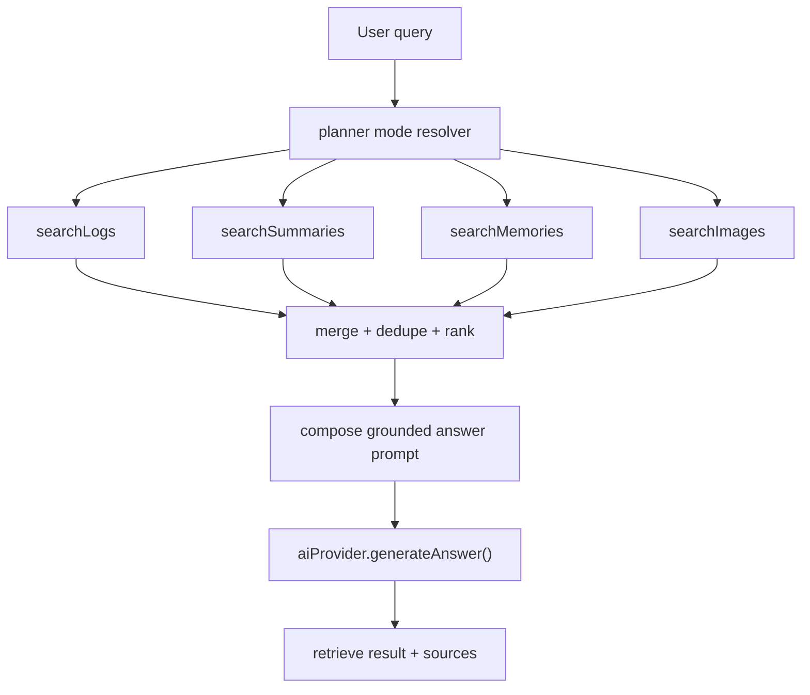
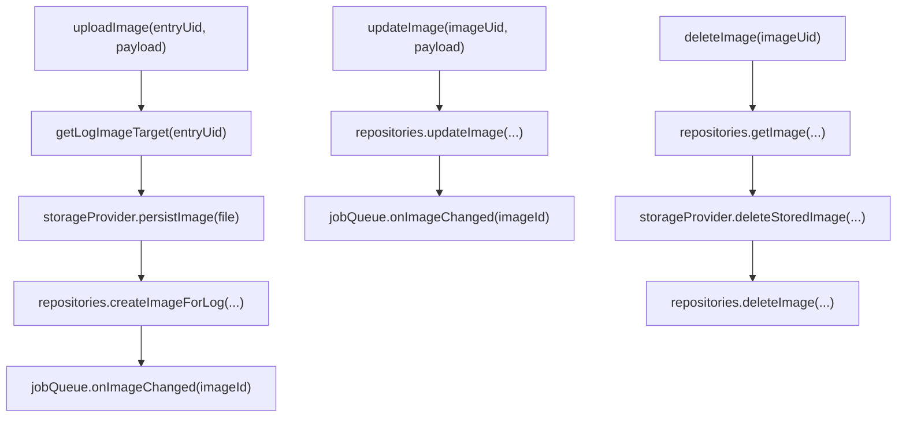

# Pupperfish architecture

Pupperfish is a **library monorepo**, not an application. It packages assistant behavior into two publishable packages and leaves all product-specific infrastructure to the host app.

## Monorepo layout
- `packages/pupperfish-framework`: headless runtime, contracts, types, planner, answer composer, normalization helpers, and embedding utilities.
- `packages/pupperfish-react`: React UI kit, signal store helpers, and a host-app-facing `PupperfishClient` contract.
- `scripts/`: smoke tests used by the workspace-level `test` script.

## Responsibility boundary
The framework owns orchestration. The host app owns data and infrastructure.

Host app responsibilities:
- data repositories for logs, summaries, memories, and images
- LLM and embedding providers
- file persistence and download URLs
- queue and worker execution
- audit persistence
- API transport and auth

Framework responsibilities:
- planner-mode selection
- retrieval fan-out and evidence ranking
- answer prompt composition
- image workflow orchestration
- worker hooks and runtime entry points

## Architecture diagram

## Runtime dependency graph
`createPupperfishRuntime(...)` is the core factory. It does not talk to a real database or model service on its own.

## Retrieve-first, answer-second
The framework is intentionally grounded. It retrieves evidence before it asks the answer model to respond.

## Planner reality
The planner is currently rule-based.
- It chooses between `sql`, `summary`, `memory`, `image`, and `hybrid`.
- It does not ship a separate agent-planner model.
- If you want a different routing policy, you override the planner keywords in runtime config.

## Chart-image workflow
The framework treats chart images as a first-class workflow, not as an afterthought.

## React package role
The React package is presentation-only. It expects a host-provided `PupperfishClient`.

- `PupperfishChatShell`: full-page conversational assistant UI
- `PupperfishWidgetShell`: launcher / mini shell that reads a signal store
- `PupperfishDock`: compact status indicator
- `TradeImageGalleryManager`: upload and manage log-bound chart images
- `createLocalStoragePupperfishUiSignalStore(...)`: lightweight cross-tab UI signal store

## Practical takeaway
If you are integrating Pupperfish, think in two steps:
1. implement the framework contracts against your real backend
2. wire the React package to your API through `PupperfishClient`
